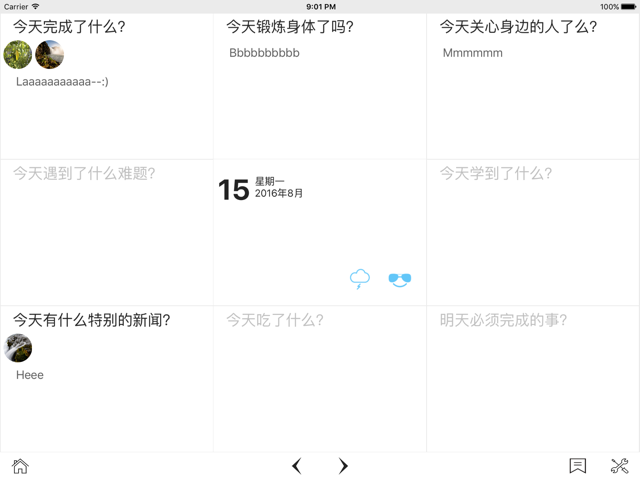
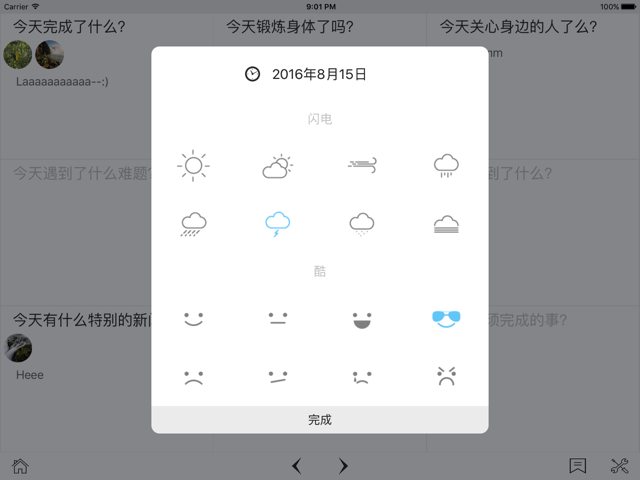
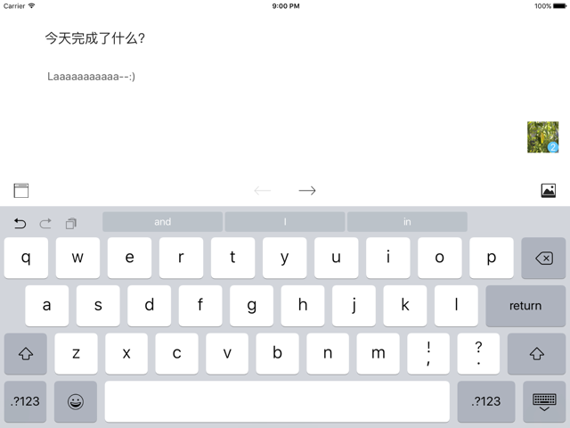
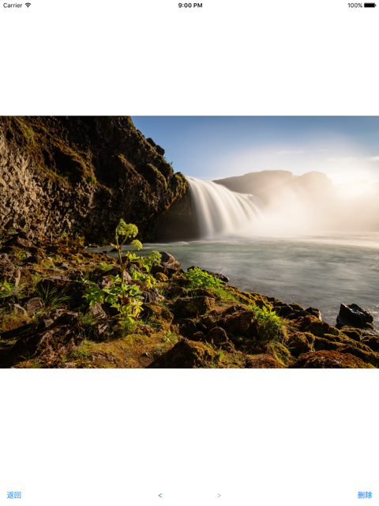
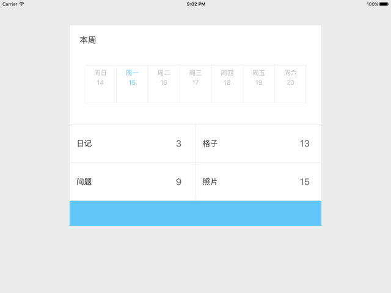
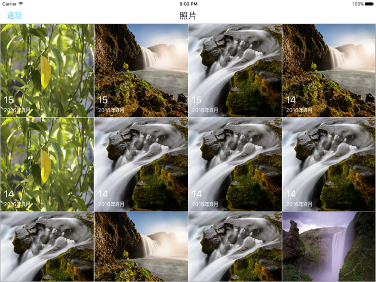
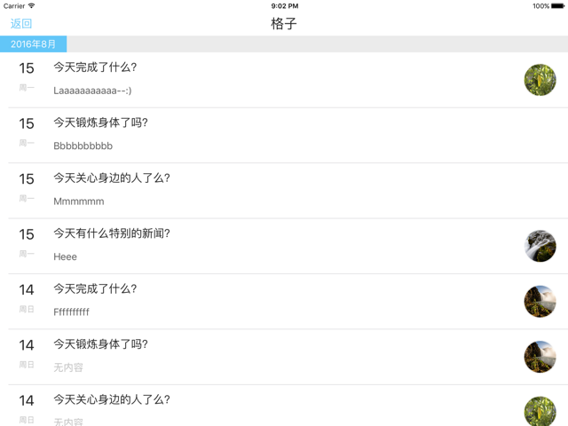

# PieceDiary

## 九宫格日记应用

仿造 “格志” 写的应用，通过九宫格问答的形式来记录日记。

### 基本功能界面：

+	**主界面**：显示当前日期所记录的内容，包括文字内容、图片、心情、天气
+	**编辑界面**：编辑记录内容，能自行修改问题，插入删除图片，预览图片等
+	**阅读界面**：能将记录能容生成到一个界面上方便阅读
+	**统计界面**：统计日记总数、图片总数、编辑过的格子总数等

### 界面截图：

#### 主界面

#### 记录心情、天气

#### 编辑内容

#### 插入的照片预览

#### 统计界面

#### 所有记录的照片

#### 编辑过的格子

#### 问题的统计

### 其他

界面暂时只做了iPad的适配。还有很多小细节未完善，待续...
